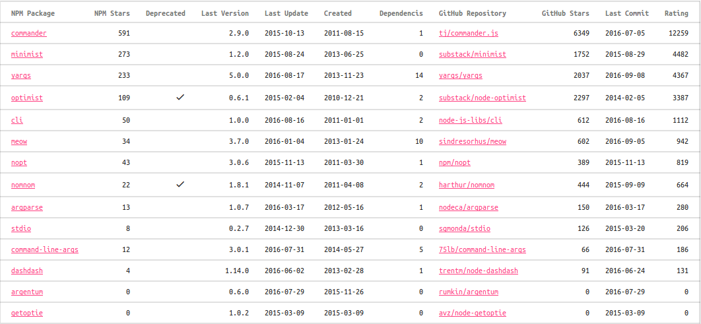
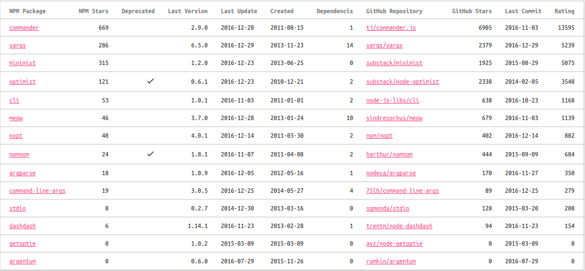

# Обзор пакетов Node.js для разбора опций командной строки

Node.js, как и другие среды разработки, предоставляет базовые средства работы с
опциями командной строки. В нашем случае это массив `process.argv`. Но обычно,
кроме простейших случаев типа A + B, обрабатывать опции командной строки
вручную очень неудобно. Для этого есть несколько популярных пакетов. Автор написал
небольшую программу, которая построила сводную таблицу по этим пакетам,
выбрал из них три самых популярных и рассмотрел их поближе.

## Рейтинговые таблицы

**Важное примечание.** С 2022 года репозитории пакетов `optimist` и `minimist` [более не доступны](https://stackoverflow.com/questions/73833369/minimist-github-page-doesnt-exit). Репозиторий `minimist` был восстановлен по новому адресу, который был найден на страничке пакета на NPM. А вот копии репозитория `optimist` там не обнаружено. По этой причине, я не рекомендую использовать эти два пакета в своих новых разработках.

Ниже приведены две версии таблиц, от 2024 и 2020 года, чтобы вы могли срравнить иъ и выявить изменения самостоятельно.

Таблица по сведениям из NPM от 2024-11-06:

| # | NPM Package | NPM Stars | Deprecated | Last Version | Last Update | Created | Dependencies |
|-|-|-|-|-|-|-|-|
| 1 | [commander](https://www.npmjs.org/package/commander) | 1015 |  | 12.1.0 | 2024-10-22 | 2011-08-15 | 0 |
| 2 | [yargs](https://www.npmjs.org/package/yargs) | 511 |  | 17.7.2 | 2024-07-15 | 2013-11-23 | 7 |
| 3 | [minimist](https://www.npmjs.org/package/minimist) | 432 |  | 1.2.8 | 2023-06-10 | 2013-06-25 | 0 |
| 4 | [optimist](https://www.npmjs.org/package/optimist) | 143 | V | 0.6.1 | 2023-04-12 | 2010-12-21 | 2 |
| 5 | [meow](https://www.npmjs.org/package/meow) | 85 |  | 13.2.0 | 2024-08-21 | 2013-01-24 | 0 |
| 6 | [cli](https://www.npmjs.org/package/cli) | 70 |  | 1.0.1 | 2023-07-12 | 2011-01-01 | 2 |
| 7 | [command-line-args](https://www.npmjs.org/package/command-line-args) | 48 |  | 6.0.1 | 2024-10-28 | 2014-05-27 | 4 |
| 8 | [nopt](https://www.npmjs.org/package/nopt) | 47 |  | 8.0.0 | 2024-09-05 | 2011-03-30 | 1 |
| 9 | [nomnom](https://www.npmjs.org/package/nomnom) | 32 | V | 1.8.1 | 2022-06-22 | 2011-04-08 | 2 |
| 10 | [argparse](https://www.npmjs.org/package/argparse) | 22 |  | 2.0.1 | 2023-10-21 | 2012-05-17 | 0 |
| 11 | [dashdash](https://www.npmjs.org/package/dashdash) | 9 |  | 2.0.0 | 2022-06-14 | 2013-02-28 | 1 |
| 12 | [stdio](https://www.npmjs.org/package/stdio) | 8 |  | 2.1.3 | 2024-01-25 | 2013-03-16 | 0 |
| 13 | [has-flag](https://www.npmjs.org/package/has-flag) | 6 |  | 5.0.1 | 2023-04-18 | 2015-07-08 | 0 |
| 14 | [getopts](https://www.npmjs.org/package/getopts) | 5 |  | 2.3.0 | 2022-05-03 | 2015-05-08 | 0 |
| 15 | [clp](https://www.npmjs.org/package/clp) | 2 |  | 4.0.12 | 2022-06-13 | 2015-04-17 | 3 |
| 16 | [clap](https://www.npmjs.org/package/clap) | 1 |  | 3.1.1 | 2022-06-13 | 2014-02-10 | 1 |
| 17 | [argentum](https://www.npmjs.org/package/argentum) | 0 |  | 0.6.0 | 2022-06-13 | 2015-11-26 | 0 |
| 18 | [getoptie](https://www.npmjs.org/package/getoptie) | 0 |  | 1.0.2 | 2022-06-18 | 2015-03-09 | 0 |
| 19 | [cli-kit](https://www.npmjs.org/package/cli-kit) | 0 |  | 2.0.2 | 2022-07-08 | 2015-10-19 | 10 |

Таблица по сведениям из NPM от 2020-01-07:

| # | NPM Package | NPM Stars | Deprecated | Last Version | Last Update | Created | Dependencies |
|-|-|-|-|-|-|-|-|
| 1 | [commander](https://www.npmjs.org/package/commander) | 1011 |  | 4.1.0 | 2020-01-06 | 2011-08-15 | 0 |
| 2 | [yargs](https://www.npmjs.org/package/yargs) | 512 |  | 15.1.0 | 2020-01-02 | 2013-11-23 | 11 |
| 3 | [minimist](https://www.npmjs.org/package/minimist) | 432 |  | 1.2.0 | 2019-08-11 | 2013-06-25 | 0 |
| 4 | [optimist](https://www.npmjs.org/package/optimist) | 143 | V | 0.6.1 | 2018-03-21 | 2010-12-21 | 2 |
| 5 | [meow](https://www.npmjs.org/package/meow) | 79 |  | 6.0.0 | 2019-12-07 | 2013-01-24 | 11 |
| 6 | [cli](https://www.npmjs.org/package/cli) | 69 |  | 1.0.1 | 2018-03-15 | 2011-01-01 | 2 |
| 7 | [command-line-args](https://www.npmjs.org/package/command-line-args) | 49 |  | 5.1.1 | 2019-03-31 | 2014-05-27 | 4 |
| 8 | [nopt](https://www.npmjs.org/package/nopt) | 47 |  | 4.0.1 | 2020-01-02 | 2011-03-30 | 2 |
| 9 | [nomnom](https://www.npmjs.org/package/nomnom) | 32 | V | 1.8.1 | 2018-03-17 | 2011-04-08 | 2 |
| 10 | [argparse](https://www.npmjs.org/package/argparse) | 21 |  | 1.0.10 | 2018-02-27 | 2012-05-17 | 1 |
| 11 | [stdio](https://www.npmjs.org/package/stdio) | 9 |  | 2.0.1 | 2019-12-19 | 2013-03-16 | 0 |
| 12 | [dashdash](https://www.npmjs.org/package/dashdash) | 9 |  | 1.14.1 | 2017-12-28 | 2013-02-28 | 1 |
| 13 | [has-flag](https://www.npmjs.org/package/has-flag) | 5 |  | 4.0.0 | 2019-04-06 | 2015-07-08 | 0 |
| 14 | [clp](https://www.npmjs.org/package/clp) | 2 |  | 4.0.11 | 2019-01-03 | 2015-04-17 | 3 |
| 15 | [clap](https://www.npmjs.org/package/clap) | 1 |  | 2.0.1 | 2019-12-17 | 2014-02-10 | 1 |
| 16 | [argentum](https://www.npmjs.org/package/argentum) | 0 |  | 0.6.0 | 2016-07-29 | 2015-11-26 | 0 |
| 17 | [getoptie](https://www.npmjs.org/package/getoptie) | 0 |  | 1.0.2 | 2015-03-09 | 2015-03-09 | 0 |

Таблица по сведениям из GitHub от 2024-11-07:

| # | NPM Package | GitHub Repository | GitHub Stars | Last Commit |
|-|-|-|-|-|
| 1 | [commander](https://www.npmjs.org/package/commander) | [tj/commander.js](https://github.com/tj/commander.js) | 26764 | 2024-05-18 |
| 2 | [yargs](https://www.npmjs.org/package/yargs) | [yargs/yargs](https://github.com/yargs/yargs) | 11097 | 2024-01-05 |
| 3 | [meow](https://www.npmjs.org/package/meow) | [sindresorhus/meow](https://github.com/sindresorhus/meow) | 3543 | 2024-03-03 |
| 4 | [cli](https://www.npmjs.org/package/cli) | [node-js-libs/cli](https://github.com/node-js-libs/cli) | 803 | 2016-10-23 |
| 5 | [getopts](https://www.npmjs.org/package/getopts) | [jorgebucaran/getopts](https://github.com/jorgebucaran/getopts) | 634 | 2021-02-15 |
| 6 | [minimist](https://www.npmjs.org/package/minimist) | [minimistjs/minimist](https://github.com/minimistjs/minimist) | 548 | 2024-06-12 |
| 7 | [optimist](https://www.npmjs.org/package/optimist) | [substack/node-optimist](https://github.com/substack/node-optimist) |  |  |
| 8 | [command-line-args](https://www.npmjs.org/package/command-line-args) | [75lb/command-line-args](https://github.com/75lb/command-line-args) | 693 | 2024-10-28 |
| 9 | [nopt](https://www.npmjs.org/package/nopt) | [npm/nopt](https://github.com/npm/nopt) | 528 | 2024-09-26 |
| 10 | [argparse](https://www.npmjs.org/package/argparse) | [nodeca/argparse](https://github.com/nodeca/argparse) | 491 | 2022-05-10 |
| 11 | [nomnom](https://www.npmjs.org/package/nomnom) | [harthur/nomnom](https://github.com/harthur/nomnom) | 470 | 2015-09-09 |
| 12 | [dashdash](https://www.npmjs.org/package/dashdash) | [trentm/node-dashdash](https://github.com/trentm/node-dashdash) | 175 | 2021-05-09 |
| 13 | [stdio](https://www.npmjs.org/package/stdio) | [sgmonda/stdio](https://github.com/sgmonda/stdio) | 158 | 2024-01-25 |
| 14 | [has-flag](https://www.npmjs.org/package/has-flag) | [sindresorhus/has-flag](https://github.com/sindresorhus/has-flag) | 92 | 2021-07-19 |
| 15 | [clap](https://www.npmjs.org/package/clap) | [lahmatiy/clap](https://github.com/lahmatiy/clap) | 19 | 2022-04-20 |
| 16 | [cli-kit](https://www.npmjs.org/package/cli-kit) | [appcelerator/cli-kit](https://github.com/appcelerator/cli-kit) | 15 | 2022-07-07 |
| 17 | [clp](https://www.npmjs.org/package/clp) | [IonicaBizau/clp](https://github.com/IonicaBizau/clp) | 12 | 2020-08-09 |
| 18 | [argentum](https://www.npmjs.org/package/argentum) | [rumkin/argentum](https://github.com/rumkin/argentum) | 1 | 2016-07-29 |
| 19 | [getoptie](https://www.npmjs.org/package/getoptie) | [avz/node-getoptie](https://github.com/avz/node-getoptie) | 0 | 2015-03-09 |

Таблица по сведениям из GitHub от 2020-01-07:

| # | NPM Package | GitHub Repository | GitHub Stars | Last Commit |
|-|-|-|-|-|
| 1 | [commander](https://www.npmjs.org/package/commander) | [tj/commander.js](https://github.com/tj/commander.js) | 16885 | 2020-01-06 |
| 2 | [yargs](https://www.npmjs.org/package/yargs) | [yargs/yargs](https://github.com/yargs/yargs) | 7154 | 2020-01-02 |
| 3 | [minimist](https://www.npmjs.org/package/minimist) | [substack/minimist](https://github.com/substack/minimist) | 3950 | 2015-08-29 |
| 4 | [optimist](https://www.npmjs.org/package/optimist) | [substack/node-optimist](https://github.com/substack/node-optimist) | 2589 | 2014-02-05 |
| 5 | [meow](https://www.npmjs.org/package/meow) | [sindresorhus/meow](https://github.com/sindresorhus/meow) | 2032 | 2019-12-07 |
| 6 | [cli](https://www.npmjs.org/package/cli) | [node-js-libs/cli](https://github.com/node-js-libs/cli) | 772 | 2016-10-23 |
| 7 | [command-line-args](https://www.npmjs.org/package/command-line-args) | [75lb/command-line-args](https://github.com/75lb/command-line-args) | 451 | 2019-09-22 |
| 8 | [nopt](https://www.npmjs.org/package/nopt) | [npm/nopt](https://github.com/npm/nopt) | 478 | 2019-01-26 |
| 9 | [nomnom](https://www.npmjs.org/package/nomnom) | [harthur/nomnom](https://github.com/harthur/nomnom) | 471 | 2015-09-09 |
| 10 | [argparse](https://www.npmjs.org/package/argparse) | [nodeca/argparse](https://github.com/nodeca/argparse) | 359 | 2019-11-05 |
| 11 | [stdio](https://www.npmjs.org/package/stdio) | [sgmonda/stdio](https://github.com/sgmonda/stdio) | 143 | 2019-12-19 |
| 12 | [dashdash](https://www.npmjs.org/package/dashdash) | [trentm/node-dashdash](https://github.com/trentm/node-dashdash) | 124 | 2019-08-28 |
| 13 | [has-flag](https://www.npmjs.org/package/has-flag) | [sindresorhus/has-flag](https://github.com/sindresorhus/has-flag) | 53 | 2019-05-31 |
| 14 | [clp](https://www.npmjs.org/package/clp) | [IonicaBizau/clp](https://github.com/IonicaBizau/clp) | 12 | 2019-01-03 |
| 15 | [clap](https://www.npmjs.org/package/clap) | [lahmatiy/clap](https://github.com/lahmatiy/clap) | 16 | 2020-01-06 |
| 16 | [argentum](https://www.npmjs.org/package/argentum) | [rumkin/argentum](https://github.com/rumkin/argentum) | 1 | 2016-07-29 |
| 17 | [getoptie](https://www.npmjs.org/package/getoptie) | [avz/node-getoptie](https://github.com/avz/node-getoptie) | 0 | 2015-03-09 |

Эти таблицы была сгенерирована небольшими скриптами на JavaScript. Исходные
тексты этого обзора, включая и эту программу, расположены в репозитории на
[GitHub](https://github.com/easimonenko/node-cli-options-parsing-review).
Так как через некоторое время эти данные скорее всего устареют, вы можете,
загрузив себе эти исходники, перегенерировать эту таблицу, а также
пополнить её новыми данными просто добавив соответствующие строки в файл со
списком пакетов.

~Пакеты в таблице упорядочены по рейтингу, который считается на основе
количества звёзд на NPM и GitHub по формуле:~

```
npmStars * k + githubStars
```

~Коэффициент `k` понадобился, так как звёзды на NPM выглядят "весомее" звёзд на
GitHub. Сам коэффициент считается очень просто: суммируем количество
звёзд на NPM и на GitHub, затем делим число звёзд на GitHub на число звёзд на
NPM, округляем получившееся число, это и есть наш коэффициент `k`:~

```
k = floor( Sgithub / Snpm)
```

_Примечание._ В прежней версии статьи считался совместный рейтинг, учитывавший количество звёзд на NPM и GitHub. Однако с некоторых пор (уже несколько лет как), на NPM больше нет функции лайка понравившегося пакета. Поэтому я решил больше не считать общий рейтинг, сортировать пакеты в таблицах независимо и учитывать только звёздность пакета на GitHub.

Из получившихся таблиц хорошо видно, что главный фаворит, это пакет
*commander*. Далее идут с близким рейтингом пакеты *minimist* и *yargs*.
Хороший рейтинг имеет также пакет *optimist*, но автором он объявлен
устаревшим, а на его место он рекомендует им же написанный пакет *minimist*, а
также советует посмотреть *yargs* и *nomnom*. В качестве преемника *optimist*
также позиционируется пакет *yargs*. Авторы объявленного устаревшим *nomnom*
рекомендуют *commander*.

Таким образом в первую очередь нужно рассмотреть пакеты *commander*, *minimist*
и *yargs*. Вероятно есть смысл также обратить внимание на пакеты *meow* и
*nopt*, но не в этот раз. Уже после публикации статьи, благодаря сервису
[npms.io](https://npms.io/) удалось обнаружить ещё один популярный пакет *cli*.

## commander

Научиться использовать пакет `commander` несложно. Автор предоставил, хоть и
не всегда ясную, но всё же неплохую документацию. Чтобы разобраться, как
использовать этот пакет, нужно было как следует поэкспериментировать. Ниже я
опишу основные моменты этого пакета.

Итак, после того как мы загрузили пакет:

``` javascript
const commander = require('commander')
```

Мы можем, вызывая последовательно или раздельно его функции, настроить его на
обработку опций командной строки. При этом пакет обеспечивает:

* короткие опции, например, `-s`;
* длинные опции, например, `--source`;
* альтернативные названия опций, например, `--source` и `-s`;
* дополнительные параметры;
* значения по-умолчанию для дополнительных параметров;
* обработчики для дополнительных параметров;
* субкоманды, например, `install package`;
* автоматическое формирование подсказки;
* настройку подстказки.

Короткие опции объявляются так:

``` javascript
commander
  .option('-a', 'option a')
```

Первый аргумент функции `option` задаёт формат опции, а второй даёт ей словесное
описание. Доступ к опции `-a` в коде программы осуществляется через
соответствующее свойство `commander`:

``` javascript
if (commander.a) {
  console.log(commander.a)
}
```

Пример для длинной опции:

``` javascript
commander
  .option('--camel-case-option', 'camel case option')
```

При этом в коде доступ к опции будет происходить по имени `camelCaseOption`.

Возможно задание для опций параметров как обязательных, так необязательных:

``` javascript
commander
  .option('-s, --source <path>', 'source file')
  .option('-l, --list [items]', 'value list', toArray, [])
```

Во втором случае, параметр у опции list необязателен, для него назначены
функция-обработчик и значение по-умолчанию.

Параметры опций могут обрабатываться также с помощью регулярных выражений,
например:

``` javascript
commander
  .option('--size [size]', 'size', /^(large|medium|small)$/i)
```

Субкоманда подразумевает, что для неё пишется отдельный модуль. При этом, если
основная программа называется `program`, а субкоманда `command`, то модуль
субкоманды должен называться `program-command`. Опции, переданные после
субкоманды передаются модулю команды.

``` javascript
commander
  .command('search <first> [other...]', 'search with query')
  .alias('s')
```

Для автоматической подсказки можно указать версию программы:

``` javascript
commander.version('0.2.0')
```

Подсказка может быть сопровождена дополнительными действия, например, дополнена
нестандартными текстом. Для этого нужно обрабатывать событие `--help`.

``` javascript
commander.on('--help', () => {
  console.log('  Examples:')
  console.log('')
  console.log('    node commander.js')
  console.log('    node commander.js --help')
  console.log('    node commander.js -h')
  ...
  console.log('    node commander.js --size large')
  console.log('    node commander.js search a b c')
  console.log('    node commander.js -abc')
})
```

Завершается настройка вызовом функции `parse` с параметром `process.argv`:

``` javascript
commander.parse(process.argv)
```

## minimist

Автор пакета *minimist* предоставил весьма минималистичную документацию. Но всё
равно попробуем разобраться.

После того как мы загрузили пакет, подключим и воспользуемся им:

``` javascript
const minimist = require('minimist')

const args = minimist(process.argv.slice(2))

console.dir(args)
```

Этот незамысловатый код позволит нам начать работать с этим пакетом.
Поэкспериментируем:

``` sh
node minimist.js
```

``` javascript
{ _: [] }
```

Что мы здесь видим? Набор разобранных опций организуется в объект. Свойство с
именем `_` содержит список параметров, не связанных с опциями. Например:

``` sh
node minimist.js a b c
```

``` javascript
{ _: [ 'a', 'b', 'c' ] }
```

Продолжим эксперимент:

``` sh
node minimist.js --help
```

``` javascript
{ _: [], help: true }
```

Как видим, minimist не предоставляет автоматического отображения подсказки, а
просто определяет наличие данной опции.

Поэкспериментируем ещё:

``` sh
node minimist.js -abc
```

``` javascript
{ _: [], a: true, b: true, c: true }
```

Всё верно. Посмотрим ещё:

``` sh
node minimist.js --camel-case-option
```

``` javascript
{ _: [], 'camel-case-option': true }
```

В отличие от minimist никаких преобразований.

Опция с параметром:

``` sh
node minimist.js --source path
```

``` javascript
{ _: [], source: 'path' }
```

Со знаком равно тоже работает:

``` sh
node minimist.js --source=path
```

``` javascript
{ _: [], source: 'path' }
```

Поддерживается специальный режим передачи опций с использванием `--`:

``` sh
node minimist.js -h -- --size=large
```

``` javascript
{ _: [ '--size=large' ], h: true }
```

Аргументы, следующие за `--` не обрабатываются и просто помещаются в свойство
`_`.

Вот в общем-то и всё, что есть в базе. Посмотрим, какие возможности настройки
обработки опций предлагает нам minimist.

Для настройки обработки аргументов командной строки мы должны передать парсеру
второй параметр с нашими настройками. Рассмотрим на примерах:

``` javascript
const minimist = require('minimist')

const args = minimist(process.argv.slice(2), {
  string: ['size'],
  boolean: true,
  alias: {'help': 'h'},
  default: {'help': true},
  unknown: (arg) => {
    console.error('Unknown option: ', arg)
    return false
  }
})

console.dir(args)
```

``` sh
node minimist-with-settings.js --help
```

``` javascript
{ _: [], help: true, h: true }
```

``` sh
node minimist-with-settings.js -h
```

``` javascript
{ _: [], h: true, help: true }
```

Мы задали для опции `--help` синоним `-h`. Результат, как видим, идентичен.

Опция `boolean`, установленная в `true`, говорит о том, что все опции без
параметров после знака равно будут иметь булево значение. Например:

``` sh
node minimist-with-settings.js --no-help
```

``` javascript
{ _: [], help: false, h: false }
```

Здесь мы увидели, как обрабатываются булевы опции: префикс `no` устанавливает
значение опции равным `false`.

Но такой пример при этом больше не работает, нужен знак равно:

``` sh
node minimist-with-settings.js --size large
```

``` plain
Unknown option:  large
{ _: [], size: '', help: true, h: true }
```

Здесь же мы увидели обработку неизвестной опции и опции по-умолчанию.

Общий вывод: по сравнению с `commander` довольно минималистично, но вполне
удобно.

## yargs

В отличие от minimist и commander *yargs* предлагает весьма пространную
документацию, доступную по ссылке:
[http://yargs.js.org/docs/](http://yargs.js.org/docs/).

Как обычно начнём с минимального примера:

``` javascript
const yargs = require('yargs')

console.dir(yargs.argv)
```

``` sh
node yargs.js
```

``` javascript
{ _: [], '$0': 'yargs.js' }
```

Здесь мы видим пустой список необработанных опций, а также имя файла нашей
программы.

Рассмотрим пример посложней:

``` sh
node yargs.js -abc --help --size=large 1 2 3
```

``` javascript
{ _: [ 1, 2, 3 ],
  a: true,
  b: true,
  c: true,
  help: true,
  size: 'large',
  '$0': 'yargs.js' }
```

Здесь поинтереснее будет: во-первых, переданные опции восприняты верно;
во-вторых, для их обработки мы не написали ни строчки кода.

Но уже здесь видно, что опция `--help` без предварительной настройки по
предназначению не обрабатывается.

Рассмотрим теперь как использовать yargs в более сложных случаях на следующем
примере:

``` javascript
const yargs = require('yargs')

yargs
  .usage('Usage: $0 -abc [--list 1,2,3] --size large|meduim|small [--help]')
  .version('1.0.0')
  .demand(['size'])
  .choices('size', ['large', 'medium', 'small'])
  .default('list', [], 'List of values')
  .describe('list', 'value list')
  .array('list')
  .help('help')
  .alias('help', 'h')
  .example('$0 --size=medium')
  .epilog('(c) 2016 My Name')

console.dir(yargs.argv)
```

``` sh
node yargs.js -h
```

Получаем:

```
Usage: yargs.js -abc [--list 1,2,3] --size large|meduim|small [--help]

Options:
  --version   Show version number                                      [boolean]
  --list      value list                       [array] [default: List of values]
  --help, -h  Show help                                                [boolean]
  --size                        [required] [choices: "large", "medium", "small"]

Examples:
  yargs.js --size=medium
(c) 2016 My Name
```

В этом примере мы задали текст, который будет выводиться с опцией `help`. Опции
`help` мы также указали синоним `h`. А ещё указали версию программы, которая
будет выводиться с опцией `version`.

Опция `size` обязательная, более того, для неё задан список допустимых значений.

``` sh
node yargs.js --size large
```

``` javascript
{ _: [],
  version: false,
  help: false,
  h: false,
  size: 'large',
  list: [],
  '$0': 'yargs.js' }
```

Если `size` передать значение, не соответствующее ни одному из списка, то
получим сообщение об ошибке:

``` sh
node yargs.js --size=middle
```

```
...
Invalid values:
  Argument: size, Given: "middle", Choices: "large", "medium", "small"
```

Для опции `list` указано значение по умолчанию. Эта опция также трактуется как
массив значений:

``` sh
node yargs.js --list 1 2 3 --size=large
```

``` javascript
{ _: [],
  version: false,
  help: false,
  h: false,
  list: [ 1, 2, 3 ],
  size: 'large',
  '$0': 'yargs.js' }
```

## Резюме

Пакеты *commander* и *minimist* выделяются минимальным числом зависимостей, в то
время как *yargs* поражает не только числом своих зависимостей, но и числом
своих возможностей.

Какой пакет лучше, очевидно, сказать нельзя. По мнению автора, *minimist* вполне
достаточен для простейших случаев, но в сложных ситуациях при его использовании
придётся написать много кода обработки опций вручную. В этом случае лучше
воспользоваться *commander* или *yargs*, на ваш вкус.

Все три рассматриваемые здесь пакета имеют определения типов на TypeScript, что
позволяет иметь в [Code](https://code.visualstudio.com/) работающий
IntelliSense.

## Архив

В первоначальной редакции от 13 сентября 2016 года сводная таблица в начале статьи была следующей:



## Немного аналитики

Спустя три месяца с момента написания и публикации этой статьи на Habrahabr в
период с сентября по декабрь 2016 произошли некоторые интересные изменения в
сводной таблице.

* Рейтинг почти всех модулей вырос за исключением малопопулярных
_stdio_, _getoptie_, _argentum_.

* Вперёд "рванул" _yargs_ и вышел на второе место, сместив на третье _minimist_.
Это вполне объяснимо: minimist не развивается уже больше года, в то время как
для yargs регулярно выходят новые версии.

* Пакет _command-line-args_ обошёл _stdio_.

* Из 14 пакетов только два улучшили свои позиции. Но скорость роста рейтинга
разная, поэтому через несколько месяцев можно ожидать выявления новых фаворитов.

* Не совершенствовались следующие модули: minimist, optimist (deprecated),
nomnom (deprecated), stdio, getoptie и argentum. Вероятно эти модули скоро можно
будет объявлять deprecated.

*Самый главный вывод, какой я бы хотел сделать, это то, что стоит задуматься, а
нужно ли в своих новых проектах использовать популярный __minimist__, ведь он
достаточно давно не разрабатывается?*

Для удобства сравнения сводных таблиц привожу их здесь в виде картинок:

* Сводная таблица за сентябрь 2016<br/>


* Сводная таблица за декабрь 2016<br/>


Расклад голосования на Habrahabr таков. Проголосовало 72 читателя, воздержалось 65.
Из них отдали свои голоса следующим образом:

1. yargs 31% (22)
2. commander 29% (21)
3. minimist 21% (15)
4. process.argv 8% (6)
5. другой пакет 7% (5)
6. optimist 4% (3)

Налицо наибольшая популярность у _yargs_ и _commander_, при этом _minimist_
также достаточно популярен.

## Обновление от 8 февраля 2019

Сводная таблица обновлена, преобразована в формат Markdown и дополнена пакетами `has-flag`, `clp` и `clap`. Результаты
голосования остались примерно такими же, какими были при последнем обновлении от 30 декабря 2016 года.

## Обновление от 7 января 2020

Обновлена сводная таблица. Рейтинг пакетов существенно не изменился. Результаты голосования также показывают, что за год предпочтения ощутимо не поменялись.

## Обновление от 7 ноября 2024

Четыре года существенно не повлияли на популярность перечисленных в начале статьи пакетов. Но есть важное исключение: `minimist` и `optimist`, о чём сказано в начале статьи. Также было добавлено ещё два пакета `getopts` (попавший сразу на 5-е место) и `cli-kit` (один из аутсайдеров рейтинга).

## Лицензия

[](https://creativecommons.org/licenses/by-nd/4.0/)

Произведение
[«Обзор пакетов Node.js для разбора опций командной строки»](./article.ru.md),
созданное автором по имени [Симоненко Евгений Анатольевич](mailto:easimonenko@mail.ru),
публикуется на условиях
[лицензии Creative Commons «Attribution-NoDerivatives» («С указанием авторства — Без производных») 4.0 Всемирная](https://creativecommons.org/licenses/by-nd/4.0/).

---

(c) 2016, 2019, 2020, 2024 Евгений А. Симоненко <easimonenko@mail.ru>
