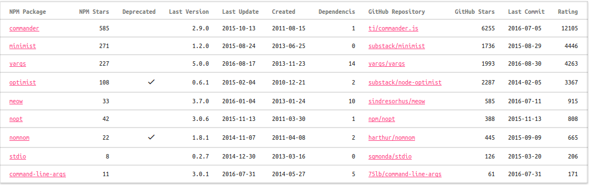

# Обзор пакетов Node.js для разбора опций командной строки

Node.js, как и другие среды разработки, предоставляет базовые средства работы с
опциями командной строки. В нашем случае это массив `process.argv`. Но обычно,
кроме простейших случаев типа A + B, обрабатывать опции командной строки
вручную очень неудобно. Для этого есть несколько популярных пакетов. Я написал
небольшую программу, которая построила сводную таблицу по этим пакетам,
выбрал из них три самых популярных и рассмотрел их поближе.

## Сводная таблица

Ниже представлена сводная таблица из самых популярных пакетов для обработки
опций командной строки.



Так как я вынужден был разместить здесь эту таблицу как изображение, то ниже
привожу список соответствующих ссылок:

1. [commander](https://www.npmjs.org/package/commander) | [tj/commander.js](https://github.com/tj/commander.js)
2. [minimist](https://www.npmjs.org/package/minimist) | [substack/minimist](https://github.com/substack/minimist)
3. [yargs](https://www.npmjs.org/package/yargs) | [yargs/yargs](https://github.com/yargs/yargs)
4. [optimist](https://www.npmjs.org/package/optimist) | [substack/node-optimist](https://github.com/substack/node-optimist)
5. [meow](https://www.npmjs.org/package/meow) | [sindresorhus/meow](https://github.com/sindresorhus/meow)
6. [nopt](https://www.npmjs.org/package/nopt) | [npm/nopt](https://github.com/npm/nopt)
7. [nomnom](https://www.npmjs.org/package/nomnom) | [harthur/nomnom](https://github.com/harthur/nomnom)
8. [stdio](https://www.npmjs.org/package/stdio) | [sgmonda/stdio](https://github.com/sgmonda/stdio)
9. [command-line-args](https://www.npmjs.org/package/command-line-args) | [75lb/command-line-args](https://github.com/75lb/command-line-args)

Эта таблица была сгенерирована небольшой программой на JavaScript. Исходные
тексты этого обзора, включая и эту программу, расположены в репозитории на
[GitHub](https://github.com/easimonenko/node-cli-options-parsing-review).
Так как через некоторое время эти данные скорее всего устареют, вы можете,
загрузив себе эти исходники, перегенерировать эту сводную таблицу, а также
пополнить её новыми данными просто добавив соответствующие строки в файл со
списком пакетов.

Пакеты в таблице упорядочены по рейтингу, который считается на основе
количества звёзд на NPM и GitHub по формуле:

```
npmStars * k + githubStars
```

Коэффициент `k` понадобился, так как звёзды на NPM выглядят "весомее" звёзд на
GitHub. Сам коэффициент считается очень просто: суммируем общее количество
звёзд на NPM и на GitHub, затем делим число звёзд на GitHub на число звёзд на
NPM, округляем получившееся число, это и есть наш коэффициент `k`.

Из получившейся таблицы хорошо видно, что главный фаворит, это пакет
*commander*. Далее идут с близким рейтингом пакеты *minimist* и *yargs*.
Хороший рейтинг имеет также пакет *optimist*, но автором он объявлен
устаревшим, а на его место он рекомендует им же написанный пакет *minimist*.
В качестве преемника *optimist* также позиционируется пакет *yargs*. Авторы
объявленного устаревшим *nomnom* рекомендуют *commander*.

Таким образом в первую очередь нужно рассмотреть пакеты *commander*, *minimist*
и *yargs*. Вероятно есть смысл также обратить внимание на пакеты *meow* и
*nopt*, но не в этот раз.

## commander

Научиться использовать пакет `commander` несложно. Автор предоставил, хоть и
невсегда ясную, но всё же неплохую документацию. Чтобы разобраться, как
использовать этот пакет, нужно было как следует поэкспериментировать. Ниже я
опишу основные моменты этого пакета.

Итак, после того как мы загрузили пакет:

``` javascript
const commander = require('commander')
```

Мы можем, вызывая последовательно или раздельно его функции, настроить его на
обработку опций командной строки. При этом пакет обеспечивает:

* короткие опции, например, `-s`;
* длинные опции, например, `--source`;
* альтернативные названия опций, например, `--source` и `-s`;
* дополнительные параметры;
* значения по-умолчанию для дополнительных параметров;
* обработчики для дополнительных параметров;
* субкоманды, например, `install package`;
* автоматическое формирование подсказки;
* настройку подстказки.

Короткие опции объявляются так:

``` javascript
commander
  .option('-a', 'option a')
```

Первый аргумент функции `option` задаёт формат опции, а второй даёт ей словесное
описание. Доступ к опции `-a` в коде программы осуществляется через
соответствующее свойство `commander`:

``` javascript
if (commander.a) {
  console.log(commander.a)
}
```

Пример для длинной опции:

``` javascript
commander
  .option('--camel-case-option', 'camel case option')
```

При этом в коде доступ к опции будет происходить по имени `camelCaseOption`.

Возможно задание для опций параметров как обязательных, так необязательных:

``` javascript
commander
  .option('-s, --source <path>', 'source file')
  .option('-l, --list [items]', 'value list', toArray, [])
```

Во втором случае, параметр у опции list необязателен, для него назначены
функция-обработчик и значение по-умолчанию.

Параметры опций могут обрабатываться также с помощью регулярных выражений,
например:

``` javascript
commander
  .option('--size [size]', 'size', /^(large|medium|small)$/i)
```

Субкоманда подразумевает, что для неё пишется отдельный модуль. При этом, если
основная программа называется `program`, а субкоманда `command`, то модуль
субкоманды должен называться `program-command`. Опции, переданные после
субкоманды передаются модулю команды.

``` javascript
commander
  .command('search <first> [other...]', 'search with query')
  .alias('s')
```

Для автоматической подсказки можно указать версию программы:

``` javascript
commander.version('0.2.0')
```

Подсказка может быть сопровождена дополнительными действия, например, дополнена
нестандартными текстом. Для этого нужно обрабатывать событие `--help`.

``` javascript
commander.on('--help', () => {
  console.log('  Examples:')
  console.log('')
  console.log('    node commander.js')
  console.log('    node commander.js --help')
  console.log('    node commander.js -h')
  console.log('    node commander.js --version')
  console.log('    node commander.js -V')
  console.log('    node commander.js -s')
  console.log('    node commander.js -s abc')
  console.log('    node commander.js --camel-case-option')
  console.log('    node commander.js --list 1,2,3')
  console.log('    node commander.js -l 1,2,3')
  console.log('    node commander.js --size=large')
  console.log('    node commander.js --size large')
  console.log('    node commander.js search a b c')
  console.log('    node commander.js -abc')
})
```

Завершается настройка вызовом функции `parse` с параметром `process.argv`:

``` javascript
commander.parse(process.argv)
```

## minimist

Автор пакета *minimist* предоставил весьма минималистичную документацию. Но всё
равно попробуем разобраться.

После того как мы загрузили пакет, подключим и воспользуемся им:

``` javascript
const minimist = require('minimist')

const args = minimist(process.argv.slice(2))

console.dir(args)
```

Этот незамысловатый код позволит нам начать работать с этим пакетом.
Поэкспериментируем:

``` sh
node minimist.js
```

``` javascript
{ _: [] }
```

Что мы здесь видим? Набор разобранных опций организуется в объект. Свойство с
именем `_` содержит список параметров, не связанных с опциями. Например:

``` sh
node minimist.js a b c
```

``` javascript
{ _: [ 'a', 'b', 'c' ] }
```

Продолжим эксперименты:

``` sh
node minimist.js --help
```

``` javascript
{ _: [], help: true }
```

Как видим, minimist не предоставляет автоматического отображения подсказки, а
просто определяет наличие данной опции.

Поэкспериментируем ещё:

``` sh
node minimist.js -abc
```

``` javascript
{ _: [], a: true, b: true, c: true }
```

Всё верно. Посмотрим ещё:

``` sh
node minimist.js --camel-case-option
```

``` javascript
{ _: [], 'camel-case-option': true }
```

В отличие от minimist никаких преобразований.

Опция с параметром:

``` sh
node minimist.js --source path
```

``` javascript
{ _: [], source: 'path' }
```

Со знаком равно тоже работает:

``` sh
node minimist.js --source=path
```

``` javascript
{ _: [], source: 'path' }
```

Поддерживается специальный режим передачи опций с использванием `--`:

``` sh
node minimist.js -h -- --size=large
```

``` javascript
{ _: [ '--size=large' ], h: true }
```

Аргументы, следующие за `--` не обрабатываются и просто помещаются в свойство
`_`.

Вот в общем-то и всё, что есть в базе. Посмотрим, какие возможности настройки
обработки опций предлагает нам minimist.

Для настройки обработки аргументов командной строки мы должны передать парсеру
второй параметр с нашими настройками. Рассмотрим на примерах:

``` javascript
const minimist = require('minimist')

const args = minimist(process.argv.slice(2), {
  string: ['size'],
  boolean: true,
  alias: {'help': 'h'},
  default: {'help': true},
  unknown: (arg) => {
    console.error('Unknown option: ', arg)
    return false
  }
})

console.dir(args)
```

``` sh
node minimist-with-settings.js --help
```

``` javascript
{ _: [], help: true, h: true }
```

``` sh
node minimist-with-settings.js -h
```

``` javascript
{ _: [], h: true, help: true }
```

Мы задали для опции `--help` синоним `-h`. Результат, как видим, идентичен.

Опция `boolean`, установленная в `true`, говорит о том, что все опции без
параметров после знака равно будут иметь булево значение. Например:

``` sh
node minimist-with-settings.js --no-help
```

``` javascript
{ _: [], help: false, h: false }
```

Здесь мы увидели, как обрабатываются булевы опции: префикс `no` устанавливает
значение опции равным `false`.

Но такой пример при этом больше не работает, нужен знак равно:

``` sh
node minimist-with-settings.js --size large
```

``` plain
Unknown option:  large
{ _: [], size: '', help: true, h: true }
```

Здесь же мы увидели обработку неизвестной опции и опции по-умолчанию.

Общий вывод: по сравнению с `commander` довольно минималистично, но вполне
удобно.


...

---

(c) 2016 Евгений А. Симоненко <easimonenko@mail.ru>
